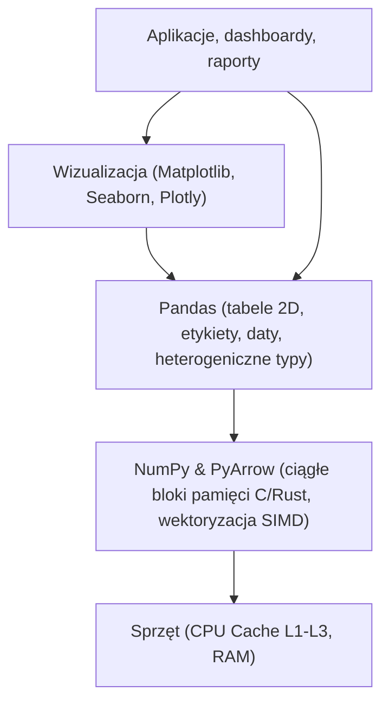

# Moduł 010: Wstęp, NumPy i Ekosystem Pandas

[🏠 Spis treści](../README.md) | [➡️ Następny moduł: 020 (Wczytywanie i eksport)](020_Wczytywanie_i_eksport_danych.md)

> **Materiały powiązane:**
>
> - Notatnik demonstracyjny: [010_Wstep_i_ekosystem_Pandas.ipynb](010_Wstep_i_ekosystem_Pandas.ipynb)
> - Notatnik z ćwiczeniami: [010_Zadania_Wstep_i_NumPy.ipynb](../cwiczenia/010_Zadania_Wstep_i_NumPy.ipynb)

---

## 1. Co siedzi pod maską: NumPy a Pandas

Pandas nie przetwarza danych w czystym Pythonie. Pod spodem opiera się na **NumPy** (a coraz częściej także na **PyArrow**). Zrozumienie tego podziału pozwala unikać typowych pułapek wydajnościowych.



### Podział ról

- **NumPy (`np.ndarray`):** Jednorodne tablice w pamięci C (np. same liczby `float64`). Brak narzutu obiektowego Pythona. Pętle wykonują się w skompilowanym kodzie z wektoryzacją SIMD na poziomie procesora.
- **Pandas (`DataFrame`, `Series`):** Tabele heterogeniczne — w jednym DataFrame każda kolumna może mieć inny typ (tekst, liczba, data). Pandas dodaje nazwane kolumny, indeksy wierszy i obsługę braków danych.

---

## 2. Przydatne funkcje NumPy w codziennej pracy z Pandas

Zamiast pisać pętle w Pythonie czy sięgać po wolne `df.apply(axis=1)`, używaj wektorowych funkcji NumPy bezpośrednio na kolumnach DataFrame:

```python
import numpy as np
import pandas as pd

# 1. Warunek dwustanowy: np.where(warunek, gdy_prawda, gdy_fałsz)
zarobki = pd.Series([3500, 7200, 12500, 4800, 9100])
podatek_prog = np.where(zarobki > 8000, 'Drugi próg (32%)', 'Pierwszy próg (12%)')
print("Progi podatkowe:", podatek_prog)

# 2. Wiele warunków: np.select(warunki, wybory, default)
warunki = [
    zarobki < 5000,
    (zarobki >= 5000) & (zarobki < 10000),
    zarobki >= 10000
]
etykiety = ['Junior / Entry', 'Mid', 'Senior / Lead']
poziom = np.select(warunki, etykiety, default='Nieznany')
print("Poziomy stanowisk:", poziom)

# 3. Brakujące wartości (np.nan)
# np.nan to standard IEEE 754 dla liczb zmiennoprzecinkowych.
# Uwaga: np.nan nie równa się samemu sobie!
print("Czy np.nan == np.nan?", np.nan == np.nan)       # Zwraca False!
print("Poprawne sprawdzenie:", np.isnan(np.nan))       # Zwraca True
print("Sprawdzenie w Pandas:", pd.isna(np.nan))        # Zwraca True

# 4. Generatory losowe (symulacje i próbkowanie)
np.random.seed(42)  # powtarzalność wyników
ceny_symulowane = np.random.normal(loc=100.0, scale=15.0, size=5)
kategorie_losowe = np.random.choice(['A', 'B', 'C'], size=5, p=[0.6, 0.3, 0.1])
```

---

## 3. Kiedy wybrać Pandas, Polars, a kiedy DuckDB?

Dobieraj narzędzie do rozmiaru danych i problemu biznesowego:

| Narzędzie | Model działania | Kiedy stosować? | Próg wejścia |
| :--- | :--- | :--- | :--- |
| **Pandas** | Tabele w pamięci RAM | Codzienna analiza, czyszczenie, eksploracja, integracja z Scikit-Learn | Niski (standard rynkowy) |
| **DuckDB** | Baza OLAP w procesie (SQL) | Analiza dużych plików Parquet/CSV bez ładowania do RAM, szybkie agregacje w SQL | Bardzo niski (jeśli znasz SQL) |
| **Polars** | Wielordzeniowy silnik w Rust (Arrow) | Przetwarzanie plików po kilkanaście-kilkadziesiąt GB, potoki ETL | Średni (inne API wyrażeń) |

---

## 4. Ekosystem wizualizacji: Matplotlib vs Seaborn vs Plotly Express

| Biblioteka | Styl API | Wynik | Kiedy stosować? |
| :--- | :--- | :--- | :--- |
| **Matplotlib** | Obiektowy (`Figure`, `Axes`) | Statyczny (PNG, PDF, SVG) | Druk, publikacje, pełna kontrola nad każdym pikselem. |
| **Seaborn** | Statystyczny | Statyczny | Szybkie macierze korelacji (heatmap), wykresy rozkładów. |
| **Plotly Express (`px`)** | Deklaratywny | Interaktywny (HTML + JS) | Raporty biznesowe, dashboardy, etykiety po najechaniu, zoom. |

> [!TIP]
> **Dlaczego Plotly Express?**
> `import plotly.express as px` pozwala wygenerować interaktywny wykres z tooltipami i zoomem w jednej linijce kodu. Gotowy wykres można wyeksportować do pojedynczego pliku HTML i wysłać mailem — odbiorca nie potrzebuje Pythona, żeby go otworzyć.

---

## 5. Widok (View), Kopia (Copy) i Copy-on-Write (CoW)

- **Widok (*View*):** Nowy obiekt wskazuje na **dokładnie ten sam fragment pamięci** co oryginał. Modyfikacja widoku zmienia też tabelę źródłową.
- **Kopia (*Copy*):** Niezależny zbiór danych w pamięci. Zmiany w kopii nie dotykają oryginału.
- **Metoda `.copy()`:**
  - `df.copy(deep=True)` (domyślnie): pełna, bezpieczna kopia danych i indeksów.
  - `df.copy(deep=False)`: kopia płytka (nowy obiekt `DataFrame`, ale bufory pamięci pozostają współdzielone).

### Copy-on-Write (CoW)

W nowszych wersjach Pandas (od wersji 2.0 opcjonalnie, docelowo standard w Pandas 3.0) wprowadzono mechanizm **Copy-on-Write**:

- Pobranie wycinka tworzy tani widok.
- Kopia w pamięci powstaje dopiero wtedy, gdy spróbujesz ten wycinek zmodyfikować (`sub.loc[:, 'kwota'] = 100`).
- Oryginał pozostaje nienaruszony, a ostrzeżenie `SettingWithCopyWarning` przestaje się pojawiać.

```python
# Włączenie trybu Copy-on-Write
pd.set_option('mode.copy_on_write', True)

df_baza = pd.DataFrame({'Miasto': ['Warszawa', 'Kraków', 'Gdańsk'], 'Liczba': [10, 20, 30]})

# Bezpieczna praca z wycinkiem — CoW chroni oryginał
wycinek = df_baza[df_baza['Liczba'] > 15]
wycinek.loc[:, 'Liczba'] = 999

print("Oryginał (nienaruszony dzięki CoW):")
print(df_baza)

# Jawna kopia (przydatna, gdy chcesz jasno zasygnalizować intencję w kodzie)
df_niezalezny = df_baza.copy(deep=True)
df_niezalezny['Liczba'] = 0
```

---

## 6. Pomiar czasu w Jupyterze: Magiczne polecenia

Zamiast zgadywać, które rozwiązanie działa szybciej, zmierz to:

| Komenda | Zakres | Liczba powtórzeń | Zastosowanie |
| :--- | :--- | :--- | :--- |
| `%time` | Jedna linia | 1 raz | Długie operacje I/O (wczytywanie dużego pliku, zapytanie SQL). |
| `%%time` | Cała komórka | 1 raz | Złożone bloki kodu, całe kroki przetwarzania. |
| `%timeit` | Jedna linia | Wiele powtórzeń | Porównywanie operacji (np. `np.where` vs `.apply`). Uśrednia wynik i podaje odchylenie. |
| `%%timeit` | Cała komórka | Wiele powtórzeń | Dokładne benchmarki algorytmów. |

---

## 7. Przydatne opcje konfiguracyjne (`pd.set_option`)

```python
import pandas as pd

# 1. Limity wyświetlania w notatniku
pd.set_option('display.max_columns', 20)      # Pokaż do 20 kolumn zamiast '...'
pd.set_option('display.max_rows', 15)         # Pokaż do 15 wierszy
pd.set_option('display.max_colwidth', 50)     # Nie obcinaj długich tekstów

# 2. Formatowanie liczb zmiennoprzecinkowych (czytelny zapis finansowy)
pd.set_option('display.float_format', lambda x: f'{x:,.2f}')  # np. 1,250,000.50

# 3. Przywrócenie ustawień domyślnych
# pd.reset_option('display.max_columns')
```

---

## 8. Podstawowe obiekty i indeksy

- **`Series`:** Jednowymiarowa tablica z etykietowanym indeksem (jedna kolumna).
- **`DataFrame`:** Dwuwymiarowa tabela złożona z serii współdzielących indeks wierszy.
- **Indeksy:**
  - `RangeIndex`: Domyślny licznik `0, 1, 2, ...` generowany w locie — nie zajmuje pamięci.
  - `Index` (tekstowy lub liczbowy): Etykiety wierszy (np. identyfikatory transakcji, kody SKU).
  - `DatetimeIndex`: Indeks ze znacznikami czasu — umożliwia resampling i grupowanie po okresach.

---

## 🎯 Ćwiczenia (w notatniku zadań)

W notatniku [010_Zadania_Wstep_i_NumPy.ipynb](../cwiczenia/010_Zadania_Wstep_i_NumPy.ipynb) przećwiczysz:

1. `np.where()` do wektorowego podziału rabatowego dla kwot transakcji powyżej zadanego progu.
2. `np.select()` do wielostopniowej segmentacji klientów według wieku (`'Junior'`, `'Dorosły'`, `'Senior'`).
