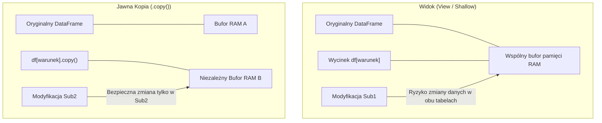

# Moduł 040: Praca z DataFrame – Selekcja, Czyszczenie i Indeksowanie

[⬅️ Poprzedni moduł: 030 (Struktura Series)](030_Praca_ze_struktura_Series.md) | [🏠 Spis treści](../README.md) | [➡️ Następny moduł: 050 (Daty i szeregi czasowe)](050_Daty_i_szeregi_czasowe.md)

> **Materiały powiązane:**
>
> - Notatnik demonstracyjny: [040_Praca_z_DataFrame_selekcja_czyszczenie.ipynb](040_Praca_z_DataFrame_selekcja_czyszczenie.ipynb)
> - Notatnik z ćwiczeniami: [040_Zadania_DataFrame.ipynb](../cwiczenia/040_Zadania_DataFrame.ipynb)

---

## 1. Tworzenie DataFrame i badanie właściwości

`DataFrame` to dwuwymiarowa tabela z etykietowanymi wierszami i kolumnami.

```python
import pandas as pd
import numpy as np

df = pd.DataFrame({
    'Klient': ['Jan Kowalski', 'Anna Nowak', 'Piotr Wiśniewski', 'Maria Dąbrowska', 'Tomasz Lis'],
    'Wiek': [28, 42, 35, 22, 51],
    'Miasto': ['Warszawa', 'Kraków', 'Warszawa', 'Gdańsk', 'Kraków'],
    'Kwota_Zakupow': [1250.50, 4300.00, 890.20, 310.00, 2150.00],
    'Status': ['Aktywny', 'VIP', 'Aktywny', 'Nowy', 'VIP']
})

# Podstawowe atrybuty tabeli
print("Kształt tabeli (.shape):", df.shape)              # (5, 5) -> 5 wierszy, 5 kolumn
print("Lista kolumn (.columns):", df.columns.tolist())
print("Indeks wierszy (.index):", df.index)
print("Typy danych (.dtypes):\n", df.dtypes)

# Podsumowanie struktury i zużycie pamięci RAM
print("\nRaport struktury (.info()):")
df.info(memory_usage='deep')

# Badanie unikalności: .nunique() i .unique()
print("\nLiczba unikalnych wartości w kolumnach (.nunique()):")
print(df.nunique())
print("Unikalne miasta (Series .unique()):", df['Miasto'].unique())

# Statystyki opisowe (.describe())
# 1. Domyślnie: tylko kolumny liczbowe
print("\nStatystyki kolumn liczbowych:")
print(df.describe())

# 2. include='all' - obejmuje także kolumny tekstowe i kategoryczne
print("\nStatystyki wszystkich kolumn (df.describe(include='all')):")
print(df.describe(include='all'))
```

---

## 2. Zarządzanie indeksem: `reset_index`, `droplevel` i `get_level_values`

```python
# 1. Ustawienie i reset indeksu
df_miasta = df.set_index('Klient')

# reset_index(drop=True) - porzucenie dotychczasowego indeksu
# Przydatne po filtrowaniu, aby przywrócić ciągłą numerację 0, 1, 2...
df_przefiltrowany = df[df['Wiek'] > 30].reset_index(drop=True)

# 2. Usuwanie poziomów indeksu: droplevel()
df_agg = df.groupby('Miasto').agg({
    'Kwota_Zakupow': ['mean', 'sum'],
    'Wiek': ['max']
})
# Usunięcie poziomu 0 ('Kwota_Zakupow', 'Wiek') z kolumn:
df_bez_poziomu0 = df_agg.copy()
df_bez_poziomu0.columns = df_bez_poziomu0.columns.droplevel(0)

# 3. get_level_values() - wyciąganie wartości z wybranego poziomu MultiIndex
funkcje_stat = df_agg.columns.get_level_values(1)
print("Nazwy metryk:", funkcje_stat.tolist())  # ['mean', 'sum', 'max']
```

---

## 3. Widok (View) vs Kopia (Copy) i metoda `.copy()`



### Praktyczna zasada

Jeśli wycinasz podzbiór danych, na którym będziesz cokolwiek modyfikować (dodawać kolumny, podmieniać wartości), zrób jawne `.copy()`. Dzięki temu masz pewność, że oryginał nie zostanie zmodyfikowany:

```python
# Bezpieczna, jawna kopia
klienci_warszawa = df[df['Miasto'] == 'Warszawa'].copy()
klienci_warszawa['Promocja'] = 'Wiosna 2024'  # Oryginał df pozostaje nienaruszony
```

---

## 4. Wybieranie danych: `[]`, `loc`, `iloc` i `query()`

```python
# 1. Wybór kolumn
s_wiek = df['Wiek']                         # Zwraca Series
df_wiek = df[['Wiek']]                      # Zwraca DataFrame z 1 kolumną
df_kilka = df[['Klient', 'Kwota_Zakupow']]  # Wiele kolumn

# 2. Dostęp loc (po etykietach) vs iloc (po pozycjach liczbowych)
wycinek_loc = df.loc[0:2, ['Klient', 'Kwota_Zakupow']]  # Wiersze 0..2 włącznie
wycinek_iloc = df.iloc[0:3, [0, 3]]                     # Wiersze 0, 1, 2 i kolumny 0, 3

# 3. Dostęp skalarowy do pojedynczej komórki (najszybszy)
wartosc = df.at[0, 'Miasto']   # po nazwie
wartosc_i = df.iat[0, 2]       # po pozycji

# 4. Filtrowanie za pomocą .query()
prog = 1000.0
wynik = df.query("Wiek >= 25 and Kwota_Zakupow > @prog and Miasto in ['Warszawa', 'Kraków']")
```

---

## 5. Czyszczenie danych: usuwanie braków (`dropna`) i parametr `subset`

Domyślne wywołanie `df.dropna()` bez parametrów usuwa każdy wiersz z choćby jednym brakiem w dowolnej kolumnie — w praktyce może to skasować większość tabeli.

### 5.1. Parametry metody `df.dropna()`

| Parametr | Typ / Wartości | Domyślnie | Zastosowanie |
| :--- | :--- | :--- | :--- |
| **`subset`** | Lista kolumn | `None` | **Kluczowy parametr.** Bada braki tylko we wskazanych kolumnach. Braki w polach opcjonalnych nie usuwają wiersza. |
| **`how`** | `'any'` lub `'all'` | `'any'` | `'any'` usuwa wiersz przy braku w *którejkolwiek* z badanych kolumn. `'all'` usuwa wiersz tylko wtedy, gdy *wszystkie* badane kolumny są puste. |
| **`thresh`** | `int` | `None` | Wymaga co najmniej tylu niepustych komórek w wierszu, by go zachować. |
| **`axis`** | `0` lub `1` | `0` | `0` usuwa wiersze, `1` usuwa całe kolumny. |
| **`ignore_index`** | `bool` | `False` | Resetuje indeks do `0..N-1` po usunięciu wierszy. |

### 5.2. Przykłady czyszczenia i wypełniania braków

```python
df_zam = pd.DataFrame({
    'id': [101, 102, 103, 104, 105],
    'klient': ['Jan', 'Anna', 'Piotr', None, 'Ewa'],
    'email': ['jan@wp.pl', None, 'piotr@o2.pl', 'kontakt@firma.pl', None],
    'kwota': [1200.0, 450.0, np.nan, 890.0, 2100.0],
    'telefon': ['601-200-300', '22-845-12', None, '500-100-200', None]
})

# 1. Diagnoza braków:
print("Liczba braków per kolumna:\n", df_zam.isnull().sum())

# 2. Bezpieczne usuwanie braków: tylko gdy brakuje kwoty transakcji:
czyste_kwoty = df_zam.dropna(subset=['kwota'], ignore_index=True)

# 3. Usunięcie tylko wtedy, gdy brakuje OBU form kontaktu (how='all'):
kontakt_wymagany = df_zam.dropna(subset=['email', 'telefon'], how='all', ignore_index=True)

# 4. Wypełnianie braków słownikiem per kolumna:
df_wypelnione = df_zam.fillna({
    'klient': 'Klient Anonimowy',
    'email': 'brak@domena.pl',
    'kwota': df_zam['kwota'].median(),
    'telefon': 'Brak danych'
})
```

---

## 6. Duplikaty: `drop_duplicates` i `duplicated`

| Parametr | Domyślnie | Zastosowanie |
| :--- | :--- | :--- |
| **`subset`** | `None` | Lista kolumn wyznaczających unikalność. Dwa wiersze uznaje się za duplikat, jeśli mają identyczne wartości w tych kolumnach. |
| **`keep`** | `'first'` | `'first'`: zachowuje pierwsze wystąpienie.<br>`'last'`: zachowuje ostatnie wystąpienie.<br>`False`: usuwa wszystkie wystąpienia duplikatu. |
| **`ignore_index`** | `False` | Resetuje indeks do `0..N-1`. |

```python
df_klienci = pd.DataFrame({
    'klient_id': [1, 2, 2, 3, 4, 4],
    'nazwisko': ['Kowalski', 'Nowak', 'Nowak-Zmienione', 'Wiśniewski', 'Dąbrowska', 'Dąbrowska'],
    'data_rejestracji': ['2024-01-10', '2024-01-12', '2024-02-01', '2024-01-15', '2024-01-20', '2024-01-20']
})

# 1. Najpierw sprawdź sporne wiersze przed usunięciem:
maska_duplikatow = df_klienci.duplicated(subset=['klient_id'], keep=False)
print("Wszystkie wiersze z duplikatem w klient_id:\n", df_klienci[maska_duplikatow])

# 2. Usuń duplikaty, zachowując najnowszy wpis (keep='last'):
dedup = df_klienci.drop_duplicates(subset=['klient_id'], keep='last', ignore_index=True)
```

---

## 7. Czyszczenie tekstu: akcesor `.str`

```python
dane = pd.DataFrame({
    'klient': ['  Jan Kowalski  ', 'ANNA NOWAK', 'piotr wiśniewski'],
    'telefon': ['+48 601-200-300', '22 845-12-90', '500 100 200'],
    'email': ['jan.k@firma.pl', 'ANNA.N@GMAIL.COM', 'piotr@domena.org']
})

# Usunięcie spacji i poprawa wielkości liter
dane['klient'] = dane['klient'].str.strip().str.title()
dane['email'] = dane['email'].str.lower()

# Czyszczenie wyrażeniem regularnym: zachowaj tylko cyfry
dane['telefon_czysty'] = dane['telefon'].str.replace(r'\D', '', regex=True)

# Ekstrakcja domeny z adresu e-mail
dane['domena'] = dane['email'].str.extract(r'@([\w\.]+)')
```

---

## 8. Sortowanie tabeli: `sort_values` i `sort_index`

```python
df_sprzedaz = pd.DataFrame({
    'Region': ['Północ', 'Południe', 'Północ', 'Wschód', 'Południe', 'Wschód'],
    'Przedstawiciel': ['Jan', 'Anna', 'Tomasz', 'Maria', 'Piotr', 'Krzysztof'],
    'Sprzedaz': [12000, 45000, np.nan, 23000, 45000, 15000]
})

# 1. Sortowanie po jednej kolumnie malejąco
ranking = df_sprzedaz.sort_values(by='Sprzedaz', ascending=False, ignore_index=True)

# 2. Sortowanie po wielu kolumnach o różnych kierunkach:
# Region rosnąco (A-Z), a wewnątrz regionu Sprzedaż malejąco
wielopoziomowe = df_sprzedaz.sort_values(
    by=['Region', 'Sprzedaz'],
    ascending=[True, False],
    ignore_index=True
)

# 3. Kontrola braków: na_position='first' umieszcza NaN na samej górze
braki_gora = df_sprzedaz.sort_values(by='Sprzedaz', na_position='first', ignore_index=True)
```

---

## 9. Częstości i rozkłady: `value_counts`

```python
transakcje = pd.DataFrame({
    'Kategoria': ['Elektronika', 'Dom', 'Elektronika', 'Moda', 'Elektronika', None, 'Moda'],
    'Kanal': ['Online', 'Sklep', 'Online', 'Online', 'Sklep', 'Online', 'Sklep'],
    'Kwota': [1200, 150, 450, 89, 3200, 510, 210]
})

# 1. Zliczanie wystąpień w kolumnie
print(transakcje['Kategoria'].value_counts())

# 2. Udziały procentowe z uwzględnieniem braków (dropna=False)
print(transakcje['Kategoria'].value_counts(normalize=True, dropna=False) * 100)

# 3. Kubełkowanie kwot (bins) - szybki histogram w tekście
print(transakcje['Kwota'].value_counts(bins=3))

# 4. Częstość kombinacji par kolumn w DataFrame:
print(transakcje.value_counts(subset=['Kategoria', 'Kanal']))
```

---

## 10. Przedziały i dyskretyzacja: `pd.cut` oraz `pd.qcut`

- **`pd.cut` (sztywne przedziały wartości):** np. z góry określone widełki wiekowe lub podatkowe.
- **`pd.qcut` (równe licznościowo grupy – kwantyle):** np. podział klientów na 4 kwartyle pod względem wydatków.

```python
# Sztywne przedziały wiekowe
df['Grupa_Wiek'] = pd.cut(df['Wiek'], bins=[0, 25, 45, 100], labels=['Młody', 'Średni', 'Senior'])

# Podział na 4 równe licznościowo grupy według wydatków
df['Kwartyl_Wydatkow'] = pd.qcut(df['Kwota_Zakupow'], q=4, labels=['Q1', 'Q2', 'Q3', 'Q4'])
```

---

## 11. Iteracja po wierszach: `itertuples()` vs `iterrows()`

### Dlaczego `iterrows()` to zły pomysł?

1. **Jest bardzo wolne:** w każdej iteracji tworzy nowy obiekt `Series`.
2. **Wypacza typy danych (*Type Coercion*):** `Series` może mieć tylko jeden typ danych. Jeśli w wierszu masz liczby, tekst i daty, wszystko zostaje rzutowane do typu `object`.
3. **Modyfikacje nie działają:** zmiana `row['kwota'] = 100` wewnątrz pętli zmienia tylko tymczasową kopię wiersza, a nie oryginalny DataFrame.

### Dlaczego `itertuples()` działa lepiej?

- Zwraca krotkę nazwaną (`namedtuple`).
- **Zachowuje oryginalne typy kolumn (`int` pozostaje `int`).**
- Działa **10–50 razy szybciej** niż `iterrows()`.

```python
df_faktury = pd.DataFrame({
    'id': [101, 102, 103],
    'klient': ['Firma Alpha', 'Firma Beta', 'Firma Gamma'],
    'kwota_netto': [1000.0, 2500.5, 800.0],
    'oplacona': [True, False, True]
})

# Prawidłowa iteracja z zachowaniem typów:
for row in df_faktury.itertuples(index=True):
    brutto = row.kwota_netto * 1.23
    status = "Opłacona" if row.oplacona else "Do zapłaty"
    print(f"Faktura {row.id} ({row.klient}): {brutto:.2f} zł -> {status}")
```

### Porównanie metod przetwarzania wierszy

| Metoda | Względny czas | Zachowanie typów (`dtypes`) | Kiedy stosować? |
| :--- | :--- | :--- | :--- |
| **Wektoryzacja NumPy (`np.where`)** | **1x (najszybsza)** | Tak | Obliczenia matematyczne, warunki logiczne na kolumnach. |
| **`df.itertuples()`** | ~10–30x wolniejsza | **Tak** | Zadania per wiersz: wysyłka e-maili, zapytania do zewnętrznych API. |
| **`df.apply(axis=1)`** | ~50–100x wolniejsza | Częściowo | Niestandardowa logika if/elif na małych tabelach (<50k wierszy). |
| **`df.iterrows()`** | ~200–500x wolniejsza | **Nie (rzutuje do `object`)** | **Unikać.** |

---

## 🎯 Ćwiczenia (w notatniku zadań)

W notatniku [040_Zadania_DataFrame.ipynb](../cwiczenia/040_Zadania_DataFrame.ipynb) przećwiczysz:

1. Czyszczenie braków z `dropna(subset=['kwota'])` z zachowaniem wierszy z brakami w polach opcjonalnych.
2. Sortowanie logów i deduplikację użytkowników z `drop_duplicates(subset=['user'], keep='last')`.
3. Sortowanie wielopoziomowe o różnych kierunkach dla poszczególnych kolumn (`ascending=[True, False]`).
4. Bezpieczną iterację po wierszach z `itertuples()` i formatowanie komunikatów.
